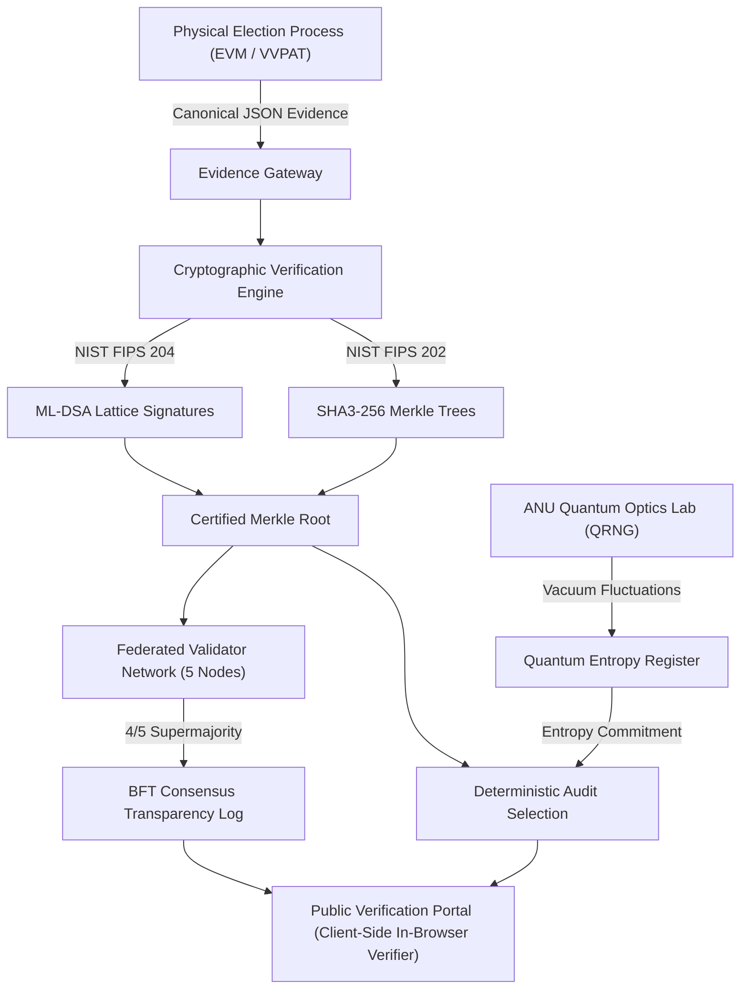

# Q-AUDIT
### Quantum-Resilient, Privacy-Preserving Election Verification & Audit Network
 
> *"Don't decentralize the vote. Decentralize the trust."*

---

## 1. Executive Overview

Modern democracies face dual crises in election administration:
1. Growing skepticism regarding electronic voting integrity.
2. The fatal flaws of generic "blockchain voting" projects (which destroy physical paper trails, force voter deanonymization, create coercion vulnerabilities, and usurp sovereign constitutional authority).

**Q-Audit** resolves this paradox by maintaining the sovereignty of the physical election process while placing an unforgeable, post-quantum mathematical transparency log around election evidence.



---

## 2. Technology Stack

- **Frontend:** React 19, TypeScript, Vite, Tailwind CSS, Lucide React, Framer Motion, Recharts, React Router v7, Axios, `js-sha3` (client-side in-browser verifier).
- **Backend:** Python 3.11+, FastAPI, Pydantic v2, SQLAlchemy 2.0, PostgreSQL 16 (with SQLite local zero-config fallback), Uvicorn.
- **Post-Quantum Cryptography:**
  - **ML-DSA-44** (NIST FIPS 204 / Dilithium2): Post-quantum digital signatures for configuration locks, station evidence, and validator attestations.
  - **ML-KEM-512** (NIST FIPS 203 / Kyber512): Module-lattice key encapsulation mechanism for secure validator node communication.
  - **SHA3-256 / 512** (NIST FIPS 202): Sponge-based collision-resistant hashing.
  - *Zero custom cryptography — mature standardized cryptographic libraries only.*
- **Quantum Entropy (QRNG):**
  - Live interface to the **Australian National University (ANU) Quantum Random Numbers API** (measuring quantum optical vacuum fluctuations in electromagnetic fields).
  - Clearly labeled CSPRNG + SHA-3 fallback simulator for offline execution.
  - Applied once at the election/audit level, **never** once per vote.
- **Zero-Knowledge Privacy:**
  - Strict domain separation: `Identity -> Eligibility -> Anonymous Credential -> ZK Proof -> Nullifier -> Evidence Domain`.
  - Non-interactive Zero-Knowledge Proof of Knowledge (Sigma protocol with Fiat-Shamir heuristic).
  - Election-specific nullifiers: $\text{SHA3-256}(x \parallel \text{election\_id})$ guaranteeing that no citizen can participate twice, without linking identity to choice.
- **Distributed Consensus Layer:**
  - 5 federated validator nodes (Government, Independent Auditor, University, Observers, Cyber Defense).
  - Byzantine Fault Tolerant (BFT) threshold agreement requiring $4/5$ supermajority for finalization.
- **Deployment & Orchestration:**
  - Docker & Docker Compose (`docker-compose.yml`) spinning up PostgreSQL, FastAPI Backend, Nginx Frontend, and 5 independent Validator daemons.

---

## 3. Database Architecture & Privacy Invariant

### Critical Architectural Principle:
The evidence database **NEVER** stores voter identity with vote choice.

```
IDENTITY DOMAIN (Separate)
      ↓
ELIGIBILITY CREDENTIAL
      ↓
ANONYMOUS CREDENTIAL (Y = G^x mod P)
      ↓
ZERO-KNOWLEDGE PROOF
      ↓
ELECTION NULLIFIER (SHA3-256(x || election_id))
      ↓
VOTING / EVIDENCE LOG (Public & Verifiable)
```

### PostgreSQL Table Schema:
1. `elections`: Master election envelopes, configuration hash, ML-DSA signature, lock status.
2. `candidates`: Public metadata, candidate SHA-3 hashes.
3. `polling_stations`: Hardware device commitments, jurisdiction hashes.
4. `evidence`: Event type (`poll_opened`, `device_commitment`, `station_summary`, `poll_closed`), canonical payload, content hash, station ML-DSA signature.
5. `cryptographic_commitments`: Binary Merkle tree roots, previous roots, algorithm, authority signature.
6. `validators`: Validator ID, organization name, type, ML-DSA public key, status (`ONLINE`, `OFFLINE`, `BYZANTINE`), last seen.
7. `validator_attestations`: Attestation ID, commitment ID, validator signature, decision (`ACCEPT` / `REJECT`).
8. `audit_runs`: QRNG entropy commitment, deterministic audit seed commitment, raw entropy, algorithm version.
9. `audit_samples`: Sampled station IDs, evidence references, deterministic derivation proofs.
10. `nullifiers`: Unique election nullifiers, first seen timestamp, status (`VALID`, `DUPLICATE_ATTEMPTED`).
11. `security_events`: Real-time tampering attempts, forged signatures, and consensus breach alerts.
12. `users`: Administrative and role-based access accounts.

---

## 4. Key Pages & Features

1. **Executive Dashboard (`/dashboard`):** Real-time telemetry, live area chart of evidence velocity, validator quorum gauges, and security alerts.
2. **Killer Demo Mode (`/demo`):** Automated 14-step presentation sequence for hackathon judges covering creation, PQC locking, evidence ingestion, Merkle roots, QRNG audit, BFT consensus, live attack detection, and reproducible audit.
3. **Public Verification Portal (`/verify`):** Citizen portal checking all 6 cryptographic checkpoints with client-side in-browser verification.
4. **Attack Simulation Lab (`/attack-lab`):**
   - **Attack 1:** Database Evidence Tampering (alters turnout count in DB -> instant Content Hash Mismatch and Merkle proof failure).
   - **Attack 2:** Forged Evidence Injection (synthetic payload with fake signature rejected by ML-DSA gateway).
   - **Attack 3:** Validator Dropout & Byzantine Quorum Failure (toggles nodes offline to test 4/5 threshold).
   - **Attack 4:** Double-Voting Replay Attack (submits duplicate nullifier -> rejected on second attempt).
5. **QRNG Audit Center (`/audits`):** Live quantum optical entropy stream + 100% exact deterministic audit sample reproduction.
6. **Merkle Explorer (`/merkle`):** Interactive binary tree visualization with leaf-to-root proof traversal.
7. **ZK Privacy Center (`/privacy`):** Demonstrates "Eligible?" without revealing "Who?".

## 🛡️ Adversarial Attack Lab

The Q-AUDIT system includes an **Adversarial Attack Lab** to demonstrate how the verification network detects and responds to different attack scenarios.

| Attack Vector | Defense Response |
|---|---|
| **Attack 1: Database Tampering**<br>*(Turnout changed in DB)* | • Malicious actor modifies turnout from **842 to 9,999** in storage.<br>• Recomputed SHA-3 hash mismatches.<br>• Merkle inclusion proof fails.<br>• ML-DSA signature check fails.<br>• System triggers **CRITICAL ALERT: "TAMPERING DETECTED"**. |
| **Attack 2: Forged Evidence**<br>*(Counterfeit ballot summary)* | • Adversary injects synthetic payload with an invalid/fake signature.<br>• PQC Gateway tests the station key.<br>• Gateway rejects ingestion: **"ML-DSA SIGNATURE INVALID"**. |
| **Attack 3: Byzantine Dropout**<br>*(Taking nodes offline)* | • Toggling **1 validator offline** still maintains the **4/5 quorum**.<br>• Toggling **2 nodes offline** drops the network to **3/5**, breaching the consensus threshold.<br>• Finalization halts until validator recovery. |
| **Attack 4: Double-Voting Replay**<br>*(Replay participation)* | • Same election nullifier is submitted twice.<br>• **1st Submission:** ACCEPTED.<br>• **2nd Submission:** REJECTED — **"DUPLICATE PARTICIPATION HALTED."** |

### Attack Simulation Flow

```text
                    ┌─────────────────────────┐
                    │   ADVERSARIAL ATTACK    │
                    │          LAB            │
                    └────────────┬────────────┘
                                 │
             ┌───────────────────┼───────────────────┐
             │                   │                   │
             ▼                   ▼                   ▼
      Database Tampering   Forged Evidence    Byzantine Dropout
             │                   │                   │
             ▼                   ▼                   ▼
        SHA-3 Hash          PQC Gateway        Quorum Check
        Verification        ML-DSA Check       Validator Status
             │                   │                   │
             └───────────────────┼───────────────────┘
                                 │
                                 ▼
                      ┌─────────────────────┐
                      │   SECURITY ALERT /  │
                      │   CONSENSUS ACTION  │
                      └─────────────────────┘
                                 ▲
                                 │
                       Double-Voting Replay
                                 │
                                 ▼
                       Nullifier Verification

```
---

## 5. Quickstart & Local Installation

### Prerequisites:
- Python 3.11+
- Node.js v20+ & npm
- Docker (optional for containerized deployment)

### 1. Backend Setup:
```bash
# In project root:
python -m venv venv
# On Windows:
.\venv\Scripts\activate
# On Linux/macOS:
source venv/bin/activate

pip install -r backend/requirements.txt

# Seed realistic demonstration election data:
$env:PYTHONPATH="backend"
python backend/app/database/seed_demo_data.py

# Launch FastAPI backend:
python -m uvicorn app.main:app --host 127.0.0.1 --port 8000 --reload
```
API Documentation will be live at: `http://127.0.0.1:8000/docs`

### 2. Frontend Setup:
```bash
cd frontend
npm install
npm run dev
```
Open `http://localhost:5173` in your browser.

---

## 6. Docker Compose Deployment

To build and run the entire network (PostgreSQL, Backend, Frontend, and 5 independent Validator daemons):
```bash
docker compose up --build
```
- Frontend: `http://localhost:5173`
- Backend API: `http://localhost:8000`
- API Docs: `http://localhost:8000/docs`
- 5 Validator Nodes running as independent background daemons communicating via BFT consensus.

---

## 7. Running Automated Tests

Run the complete test suite covering elections, PQC ML-DSA signatures, Merkle trees, QRNG audit reproducibility, BFT consensus, ZK nullifiers, and attack simulations:
```bash
$env:PYTHONPATH="backend"
pytest tests/ -v
```

---

## 8. Hackathon Presentation Walkthrough (7-Minute Flow)

1. Navigate to `/demo` and launch the **Killer Hackathon Demo**.
2. **Step 3:** Show the **ML-DSA Configuration Lock Ceremony** generating SHA3-256 hash and NIST FIPS 204 signature.
3. **Step 5:** Show the **Certified Merkle Root** constructed over all station evidence packages.
4. **Step 6 & 7:** Show the **QRNG Quantum Optical Entropy** deriving deterministic audit station samples.
5. **Step 8 & 9:** Show the **5 Federated Validator Nodes** reaching 4/5 BFT agreement.
6. **Step 10:** Open `/verify` to show the **Public Verification Portal** with 100% In-Browser Client Verification.
7. **Step 11 & 12:** Open `/attack-lab`, click **"Tamper Record"**, and show the live failure alert:
   $$\text{Content Hash Mismatch} \longrightarrow \text{Merkle Proof Invalidation} \longrightarrow \text{Signature Failure} \longrightarrow \text{Critical Alert}$$
8. **Step 13:** Click **"Reproduce Audit Sample"** to prove the audit sample is 100% mathematically deterministic.
9. **Step 14:** Demonstrate **Zero-Knowledge Double-Voting Prevention** rejecting duplicate nullifiers.

---

## 9. Security Guarantees & Non-Guarantees

### What Q-Audit Guarantees:
- **Tamper Evidence:** No adversary, even with full database access, can alter election evidence without detection.
- **Post-Quantum Resilience:** Signatures rely on lattice problems (ML-DSA / Dilithium) standardized by NIST.
- **Byzantine Resilience:** Tolerates up to $f < N/3$ compromised validator nodes through a 4 of 5 threshold.
- **Ballot Secrecy:** Zero linkage between voter identity and vote choices.

### What Cryptography Cannot Guarantee:
- Cryptography verifies that evidence has not been modified after ingestion; physical legal procedures and paper VVPAT records guarantee physical booth integrity. That is why Q-Audit operates as an external audit wrapper rather than replacing democratic procedures.
