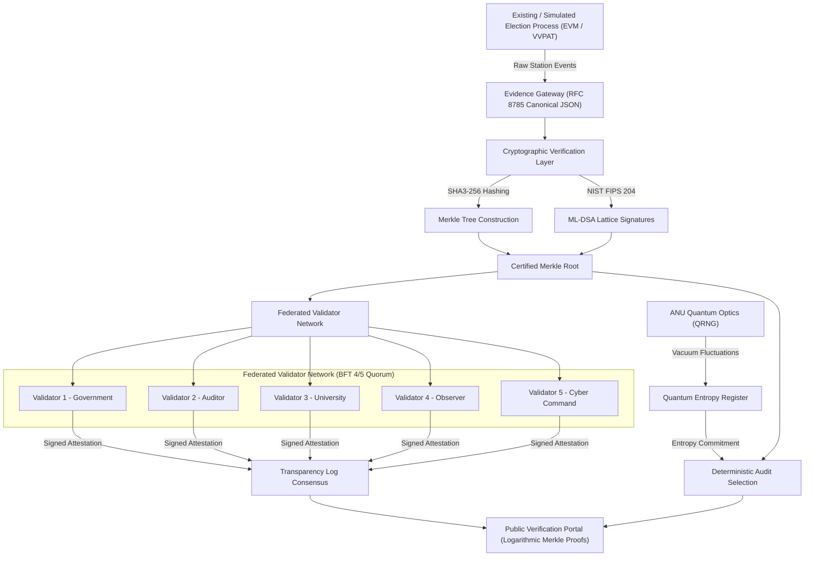

# Q-Audit System Architecture

> **Core Tagline:** *"Don't decentralize the vote. Decentralize the trust."*

---

## 1. Architectural Philosophy & Principle

Q-Audit is explicitly designed as an **independent cryptographic evidence and audit layer** placed around existing or simulated physical election processes. 

It does **NOT** replace:
- Electronic Voting Machines (EVMs)
- Voter Verified Paper Audit Trails (VVPAT)
- Election Authorities or Returning Officers
- Constitutional and legal election procedures
- The legally certified election result

---

## 2. Strict Domain Separation: Identity vs. Evidence

In strict accordance with democratic ballot privacy, the evidence database **NEVER** stores:
$$\text{voter\_identity} + \text{vote\_choice}$$

Instead, the architecture enforces a 6-stage mathematical pipeline:
1. **Identity Provider Domain:** Authenticates citizen citizenship and issues blind eligibility credential.
2. **Eligibility Domain:** Confirms eligibility without associating name to candidate.
3. **Anonymous Credential:** Client-side token deriving public commitment $Y = G^x \pmod P$.
4. **Zero-Knowledge Proof:** Non-interactive Sigma protocol / Fiat-Shamir proof of knowledge proving possession of secret $x$ without revealing it.
5. **Election Nullifier:** Deterministic, election-specific hash $\text{SHA3-256}(x \parallel \text{election\_id})$ that prevents duplicate voting without tracking identity.
6. **Evidence Domain:** Stores only anonymous commitments, Merkle proofs, and station telemetry.
